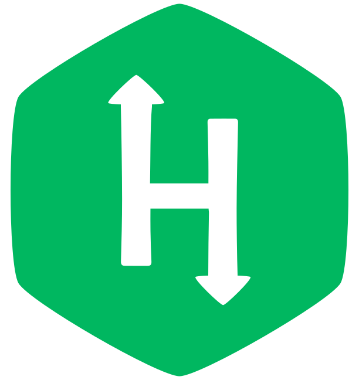

# Hi there, 

My name is Loyumba, please call me Loyum.

    
    &nbsp;&nbsp;&nbsp;
    
    &nbsp;&nbsp;&nbsp;
    
    &nbsp;&nbsp;&nbsp;
    <a href="https://leetcode.com/lmbmoirangthem033/">
        

  

## About me:

- As an AI Analyst at <b>Level AI</b>, I specialize in optimising workflows and building scalable machine learning solutions. Skilled in NLP, deep learning, and data analysis
- Eagerly navigating the realms of <b>AI and ML</b>, I am committed to continuous learning and staying at the forefront of evolving technologies in the landscape of artificial intelligence.

## 🎯 Current Focus:

- Currently working and learning about ML and AI.
- Actively enhancing proficiency in data structures and algorithms to fortify problem-solving skills.

## 🌟 What I am looking forward to at the moment: 

-  Actively seeking opportunities in data scientist/machine learning engineering roles. Excited to contribute my skills and passion for data to innovative projects. Feel free to reach out to me via email.
